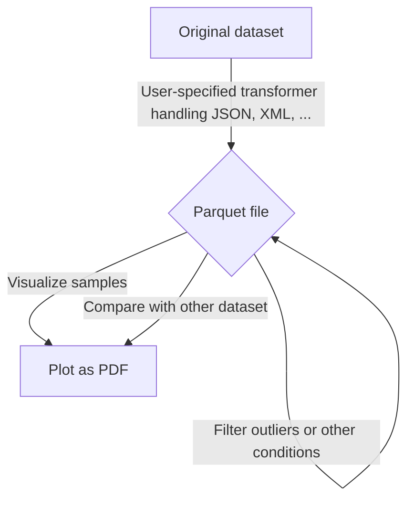

# Trace Explorer

This repository contains the source code of Trace Explorer, a toolset to explain and visualize database workload traces and benchmark datapoints.

## Usage

The first step in exploring your measurements is data preparation. Trace Explorer assist you in a multitude of ways, by automatically exploring different strategies to maximize dataset variance.



### Step 0: Converting the data into a common format

First, you have to convert your data into a common format. We use parquet for storing datasets because of its widespread compatibility and integrated compression. Each measurement must be converted into one row in the common dataset format. We provide the `CommonTraceConverter` interface to allow users to provide their own format converter. You can find examples for Snowset, Snowflake profiles, MSSQL and PostgreSQL in our `converter/` directory.

```bash
trace_explorer convert --using myconverter.py --source 'mydataset/*.merged' --output mydatasetcommon.parquet
```

The provided transformer has to export a single class called `Transformer` implementing the `trace_explorer.Transformer` abstract class.

```python3
import json
import trace_explorer

class Transformer(trace_explorer.Transformer):

    def columns():
        return ['scan', 'filter']


    def transform(line: str):
        obj = json.loads(line)
        sum = obj['rsoScan'] + obj['rsoFilter']
        return [obj['rsoScan'] / sum, obj['rsoFilter'] / sum]
```

### Step 1: Find a good preprocessing pipeline

To maximize the possibility of being able to derive conclusions from the data, a good preprocessing pipeline is very necessary. We provide a set of common preprocessing primitives, and allow for automatic tuning by optimizing for global variance.

To speed up processing, we use [DuckDB](https://duckdb.com) and Parquet for storing intermediate data.

```bash
# Clean up the dataset by dropping entries with ANY column abs zscore > 5
trace_explorer clean --zscore 5 --source mydataset.parquet --output mydataset_cleaned.parquet

# Add a new generated column from existing data
trace_explorer generate --columns execTimeLog --source mydataset.parquet --query 'select log(1 + execTime) from dataset'

# Only keep read-only queries
trace_explorer generate --source mydataset.parquet --query 'select * from dataset where writtenBytes = 0'
```
