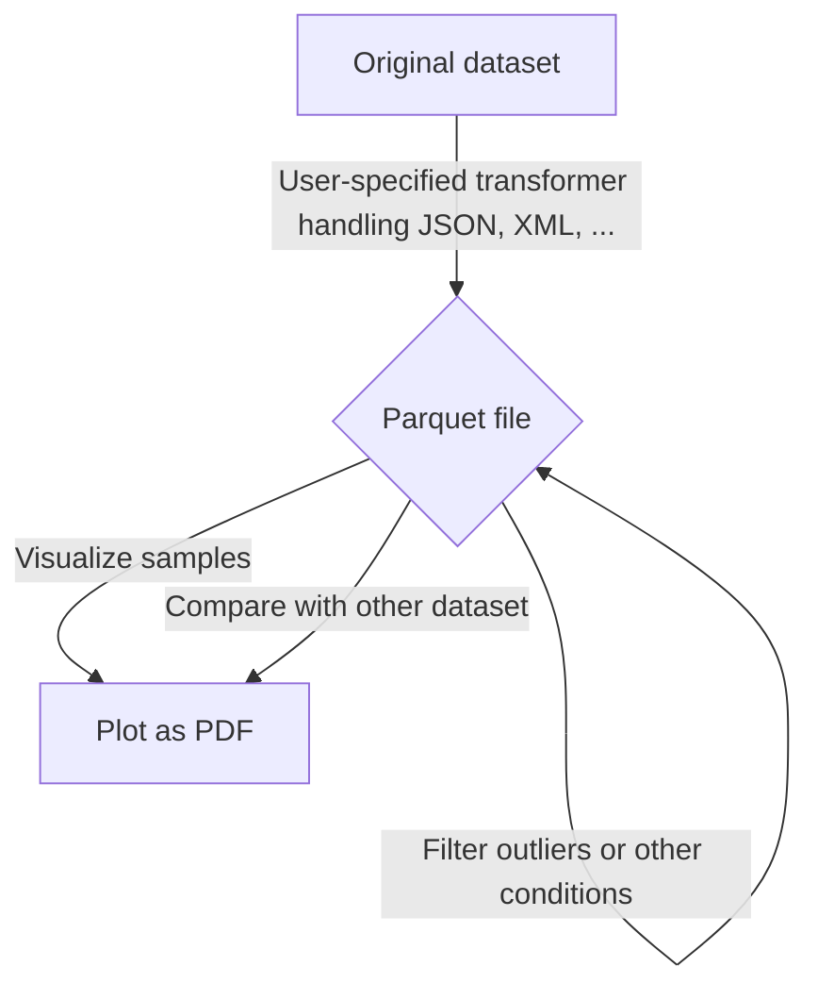

# Trace Explorer

This repository contains the source code of Trace Explorer, a toolset to explain and visualize database workload traces and benchmark datapoints.

## Installation

```bash
# Download the latest trace-explorer.zip from nightly.link
wget -O trace-explorer.zip https://nightly.link/lnsp/trace-explorer/workflows/lint/main/trace-explorer.zip
# Unzip the archive
unzip trace-explorer.zip
# Install onto your machine
pip install trace_explorer-1.0-py3-none-any.whl
# Remove zip folder and wheel
rm trace-explorer.zip trace_explorer-1.0-py3-none-any.whl
```

**Congrats, you can now use the `trace_explorer` command.**

You can also go to [the latest Build & Lint workflow](https://github.com/lnsp/trace-explorer/actions/workflows/lint.yml) and download the latest `trace-explorer.zip` under the *Artifacts* section manually.

## Web interface

Trace Explorer comes with an integrated web interface. To start it on your local machine, enter

```
trace_explorer web
```

and a web server will run on port 5000.

> Note: The web UI may not expose all features of the command-line interface.

## Command-line interface

The first step in exploring your measurements is data preparation. Trace Explorer assist you in a multitude of ways, by automatically exploring different strategies to maximize dataset variance.



### Turning the raw data into a parquet table

> In case you want to go along and test out the commands but do not have the required data at hand, you can generate sample data using the `generator.py` script in the *sample-data* folder. Go down to the section on *Generating sample data*, follow the examples there or return to this step later on.

First, you have to convert your data into a common format. We use parquet for storing datasets because of its widespread compatibility and integrated compression. Each measurement must be converted into one row in the common dataset format. We provide [the `Transformer` interface](trace_explorer/transformer.py) to allow users to provide their own format converter. You can find examples for custom transformers in the `transformers/` directory.

```bash
trace_explorer convert --using myconverter.py --source 'mydataset/*.merged' --output mydatasetcommon.parquet
```

The provided transformer has to export a single class called `Transformer` implementing the `trace_explorer.Transformer` abstract class.

```python3
import json
import trace_explorer.transformer

class Transformer(trace_explorer.transformer.Transformer):
    def columns(self):
        return ['scan', 'join', 'filter']

    def transform(self, content: str):
        obj = json.loads(content)
        return [obj['scan'], obj['join'], obj['filter']]
```

### Find a good preprocessing pipeline

To maximize the possibility of being able to derive conclusions from the data, a good preprocessing pipeline is very necessary. We provide a set of common preprocessing primitives, and allow for automatic tuning by optimizing for global variance.

To speed up processing, we use [DuckDB](https://duckdb.com) and Parquet for storing intermediate data.

```bash
# Clean up the dataset by dropping entries with ANY column abs zscore > 5
trace_explorer clean --zscore 5 --source mydataset.parquet --output mydataset_cleaned.parquet

# Add a new generated column from existing data
trace_explorer generate --source mydataset.parquet --query 'select log(1 + execTime) as execTimeLog from dataset'

# Only keep read-only queries
trace_explorer generate --source mydataset.parquet --no_copy --query 'select * from dataset where writtenBytes = 0'

# Print out useful dataset stats
trace_explorer stats --source mydataset.parquet
```

### Visualize your dataset

To make the most sense of your trace, you probably want to visualize your dataset. Trace Explorer supports clustering, auto-labeling and visualizing dataset clusters by

- performing clustering on a transformed subset of your original dataset
- auto-labeling the discovered clusters
- plotting them in a 2D scatter plot using a TSNE embedding
- (optional) training a tree classifier to cluster entire dataset

```bash
# Generate a plot with auto-labeled clusters
trace_explorer visualize --source mydataset.parquet --threshold 5
```

### Compare different traces

Finding a good way to compare cluster traces is difficult. A good approach when operating on a common or subset/superset feature space is to

- either limit the feature superset to the feature subset OR use a good imputation strategy to generate the missing columns
- concatenate both datasets
- take a subset of data to cluster via agglomerative clustering
- use a random forest classifier to 'learn' the classification
- apply classification to a larger set of data, compute visualization for that as well
- visualize large set of data with trained classification

```bash
# Compare both datasets in a single visualization
trace_explorer compare --superset dataset1.parquet --subset dataset2.parquet --exclude badcolumns
```
## Generating sample data

The repository contains a simple `generator.py` script in the `sample-data` directory. It generates multi-dimensional clustered data sampled from Laplace distributions.

```bash
# Generate a 2-column dataset with a join, scan and filter field with 5 clusters and 100 samples per cluster
sample-data/generator.py -c join -c scan -c filter -n 300 -k 5 -d sample-data/raw/

# Convert the dataset into parquet
trace_explorer convert --using sample-data/transformer.py --destination sample-data/raw.parquet --source 'sample-data/raw/*.json'

# Visualize the dataset, spills out a file named plot.pdf
trace_explorer visualize --source sample-data/raw.parquet --threshold 20

# Compare two sampled datasets
trace_explorer compare --superset sample-data/raw.parquet --subset sample-data/raw2.parquet
```
